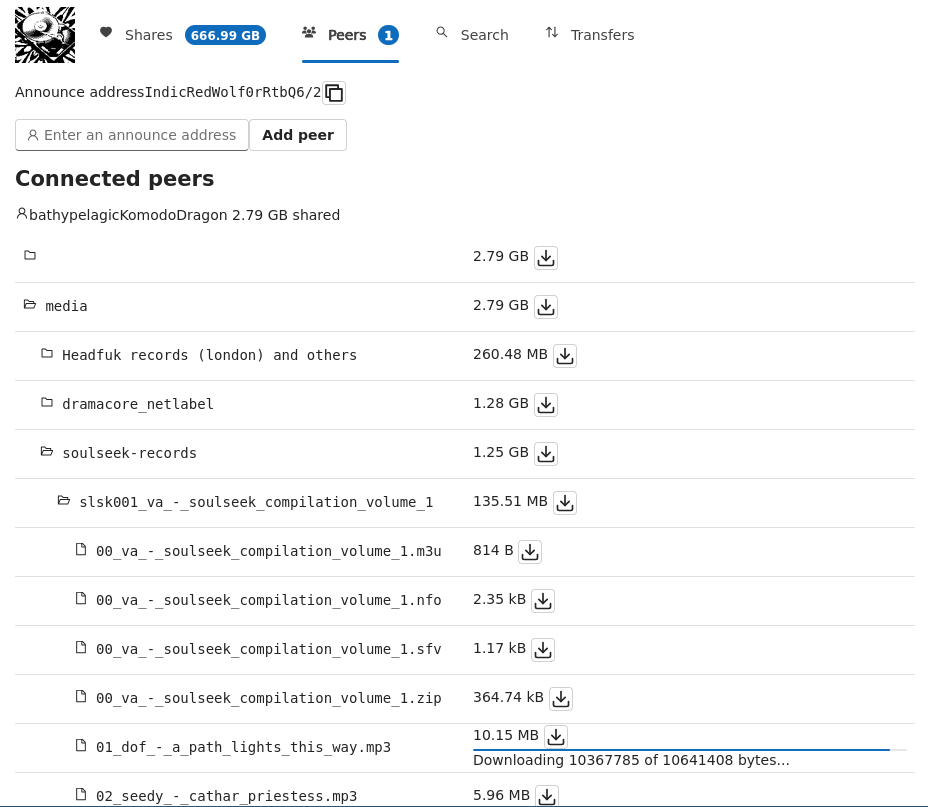

## harddrive-party

Allows two or more peers to share files. Peers can choose directories to share, and connect to each other by exchanging codes containing their connection details.

## Features / design goals

- Local and remote download/upload queueing. 
- Minimal initial setup - don't need to wait long for shared files to index (no hashing).
- Udp hole-punching - with support for asymmetric to symmetric NAT connections using the birthday paradox. For an explanation see [Tailscale's NAT traversal article](https://tailscale.com/blog/how-nat-traversal-works).
- Practical for transferring large media collections.
- Remote control via websocket / HTTP interface. Can be run on a headless device or NAS and controlled from another computer.
- Minimal reliance on centralised infrastructure - servers are only used for STUN.
- Offline-first - peers can find each other on local network using mDNS.
- Support slow / intermittent connections - downloads continue from where they left off following dropped connection or restarting the process.
- Hackable open source protocol.

## Installation

`cargo install --locked harddrive-party`

## Usage

`harddrive-party start --share-dir ~/my-dir-to-share`

Open `http://127.0.0.1:3030` in your browser.

### CLI quick reference

- `start`
  - Starts the peer process and local UI server.
  - Options:
    - `--share-dir <PATH>` (repeatable)
    - `--storage <PATH>` (defaults to `$XDG_DATA_HOME/harddrive-party` or `~/.local/share/harddrive-party`)
    - `--download-dir <PATH>` (defaults to `~/Downloads`)
    - `--no-mdns` (disable local-network discovery)
- `connect <announce-address>`
  - Ask the running process to connect to a peer.
- `ls [peer/path]`
  - Query remote peer indexes.
- `shares [path]`
  - Query your own indexed shares.
- `download <peer/path>`
  - Start a download request.
- `read <peer/path> [--start <N>] [--end <N>]`
  - Stream a remote file (or range) directly to stdout.
- `stop`
  - Gracefully shut down the running process.

Global options:

- `--ui-address <URL>` (default `http://127.0.0.1:3030`) for commands that talk to the UI server.
- `--verbose` to enable debug logging (`harddrive_party=debug`).

Send your 'announce address' to someone you want to connect to (using some external messaging system).

Enter the 'announce address' of the peer you sent yours to.

Once this is done you should be able to see their shared files in the 'Peers' tab.

You will automatically also connect to anyone else they are connected to - that is, peer details are 'gossiped'.

Download a file or directory by clicking the download button next to it. You can see the status of downloads and view downloaded files in the 'Transfers' tab. 

To try it out, you can try connecting to the announce address `bathypelagicKomodoDragonx4hZOg2U0`. But things will work a bit different because this peer is running on a server which is not behind NAT. This means you can connect to them without giving them your own announce address. This instance is used for experimenting with new features and there is no guarantee that it will be running or functioning correctly. Also, if someone else connects to that peer, your details will be 'gossiped' allowing you to connect to them directly as well.

## Protocol

### Peer discovery

There are 3 methods of peer discovery:
- Manual connections by directly entering a peer's connection details using the UI. The connection details consist of IP address, port, NAT type and a name derived from the public key. For example: `IndicRedWolf0rtRbD7b2` - here `IndicRedWolf` is derived from public key, and `0rRtbQ7b2` is the connection details.
- 'Gossiped' connections by which peers who are already connected can pass on the details of others they are also connected to.
- [Multicast DNS](https://en.wikipedia.org/wiki/Multicast_DNS) is also used to find peers connected to the same local network.

UDP hole-punching is used to connect peers who are behind a NAT or firewall.

### Transport

Peers connect to each other using [QUIC](https://en.wikipedia.org/wiki/QUIC), with client authentication using Ed25519. A QUIC stream is opened for each RPC request to a peer. There are three types of wire message:

- `Ls` - for querying the shared file index (with a sub-path, or search term).
- `Read` - for downloading a file, or portion of a file. 
- `AnnouncePeer` - for passing on connection details of another peer.

These [wire messages](./shared/src/wire_messages.rs) are serialized with [bincode](https://docs.rs/bincode).

### Shared files

To speed up file index queries, shared directories are indexed using a key-value store ([sled](https://docs.rs/sled)). The only metadata stored is filenames and sizes.

A 'wishlist' of requested files is also stored in the database so that if a connection is lost, the files will be re-requested next time you connect to that peer.

### HTTP / WebSocket control interface

The UI server exposes:

- WebSocket events on `/ws`
- HTTP endpoints under `/api/*` used by both the web UI and CLI client helpers
- Static access to downloaded files under `/downloads/*`

Most `/api/*` payloads are bincode-encoded rather than JSON (see [`shared/src/client/mod.rs`](./shared/src/client/mod.rs)).

### Peer names

There are no usernames - peers are represented by an adjective and type of animal which is derived from their public authentication key. For example: 'PersianChinchilla'.

## Logging

You can switch on logging by setting the environment variable `RUST_LOG=harddrive_party=debug` or by starting with the `--verbose` command line option.

## Web user interface

There is a work-in-progress web-based front end build with [Leptos](https://docs.rs/leptos) and [ThawUI](https://github.com/thaw-ui/thaw), served by default to `http://127.0.0.1:3030`. Source code in [`./web-ui`](./web-ui)

## Contributing

The source code is hosted on both [github](https://github.com/ameba23/harddrive-party) and [gitlab](https://gitlab.com/pegpeg/harddrive-party). I generally use gitlab for PRs and issues, but feel free to use github if you don't have a gitlab account.

## Project status

Currently pre-alpha - expect bugs and breaking changes.

This is based on a previous NodeJS project - [pegpeg/hdp](https://gitlab.com/pegpeg/hdp) - but has many protocol-level changes.
