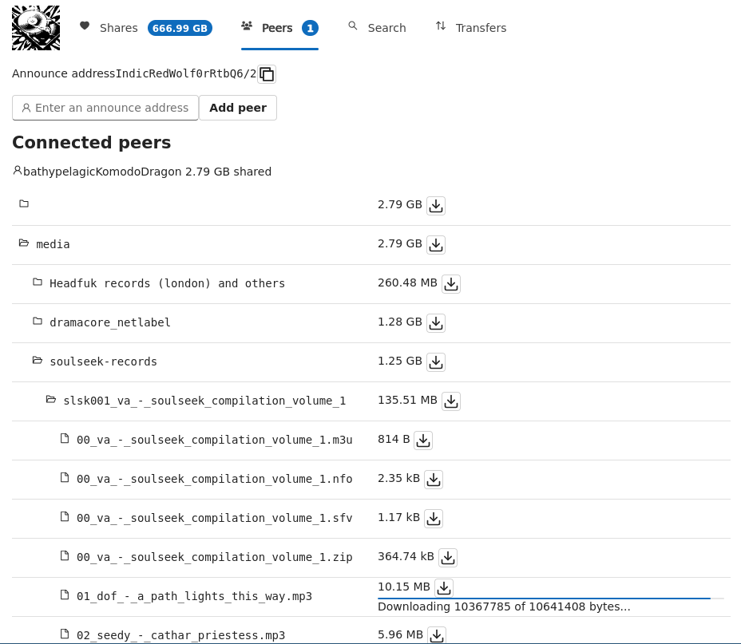

## harddrive-party

Allows two or more peers to share files. Peers can choose directories to share, and connect to each other by exchanging codes containing their connection details.

## Features / design goals

- Local and remote download/upload queueing.
- Minimal initial setup - don't need to wait long for shared files to index (no hashing).
- Udp hole-punching - with support for asymmetric to symmetric NAT connections using the birthday paradox. For an explanation see [Tailscale's NAT traversal article](https://tailscale.com/blog/how-nat-traversal-works).
- Practical for transferring large media collections.
- Remote control via websocket / HTTP interface. Can be run on a headless device or NAS and controlled from another computer.
- Minimal reliance on centralised infrastructure - servers are only used for STUN.
- Offline-first: Local-network discovery using mDNS. Startup currently still performs STUN NAT detection.
- Support slow / intermittent connections - downloads continue from where they left off following dropped connection or restarting the process.
- Hackable open source protocol.

## Installation

`cargo install --locked harddrive-party`

Or install from a flake:

```sh
nix profile install gitlab:pegpeg/harddrive-party#harddrive-party
```

## Usage

`harddrive-party start --share-dir ~/my-dir-to-share`

Open `http://127.0.0.1:3030` in your browser.

### CLI quick reference

- `start`
  - Starts the peer process and local UI server.
  - Options:
    - `--share-dir <PATH>` (repeatable)
    - `--storage <PATH>` (defaults to `$XDG_DATA_HOME/harddrive-party` or `~/.local/share/harddrive-party`)
    - `--download-dir <PATH>` (defaults to `~/Downloads`)
    - `--no-mdns` (disable local-network discovery)
    - `--local-address <IP:PORT>` (local QUIC socket address to bind for peer connections; defaults to the local IP and previously used port, or an OS-assigned port if none is stored)
    - `--stun-server <HOST:PORT>` (repeatable, overrides the built-in STUN server list)
- `connect <announce-address>`
  - Ask the running process to connect to a peer.
- `disconnect <peer-id-or-name>`
  - Disconnect from a peer and suppress automatic reconnects until you explicitly connect again.
- `ls [peer-id-or-name/path]`
  - Query remote peer indexes.
  - Options:
    - `--searchterm <TERM>` (filter paths case-insensitively)
    - `--recursive <BOOL>` (defaults to `true`)
- `shares [path]`
  - Query your own indexed shares.
  - Options:
    - `--searchterm <TERM>` (filter paths case-insensitively)
    - `--recursive <BOOL>` (defaults to `true`)
- `download <peer-id-or-name/path>`
  - Start a download request.
- `read <peer-id-or-name/path> [--start <N>] [--end <N>]`
  - Stream a remote file (or range) directly to stdout.
- `stop`
  - Gracefully shut down the running process.

Global options:

- `--ui-address <URL>` (default `http://127.0.0.1:3030`) for commands that talk to the UI server.
- `--verbose` to enable debug logging (`harddrive_party=debug`).

A peer's canonical identity is its full 43-character, URL-safe, unpadded
base64 Ed25519 public key. CLI selectors accept that full ID first. As a
convenience they also accept an exact, case-sensitive animal-name label when
exactly one connected peer has that label. Ambiguous labels are rejected and
the matching full IDs are shown. Command output displays the animal label with
an abbreviated ID.

Send your 'announce address' to someone you want to connect to (using some external messaging system).

Enter the 'announce address' of the peer you sent yours to.

Once this is done you should be able to see their shared files in the 'Peers' tab.

You will automatically also connect to anyone else they are connected to - that is, peer details are 'gossiped'.

Download a file or directory by clicking the download button next to it. You can see the status of downloads and view downloaded files in the 'Transfers' tab.

Shared directories can also be added or removed at runtime from the 'Shares' tab. The display name for a share is the final path component of the directory. If that name is already in use, a unique alias is generated from the shortest useful path suffix.



## Protocol

### Peer discovery

There are 3 methods of peer discovery:
- Manual connections by entering an announce code in the UI. A code contains
  the peer's full Ed25519 public key followed by the compact IP address, port,
  and NAT-type suffix. The public-key prefix is always 43 URL-safe base64
  characters; the existing suffix uses standard unpadded base64 plus a final
  type digit. For example,
  `AAAAAAAAAAAAAAAAAAAAAAAAAAAAAAAAAAAAAAAAAAAG1/LAHFY0` represents a fixed
  public key followed by IPv4 address/port details. Old animal-name-prefixed
  codes are rejected.
- 'Gossiped' connections by which peers who are already connected can pass on the details of others they are also connected to.
- [Multicast DNS](https://en.wikipedia.org/wiki/Multicast_DNS) is also used to find peers connected to the same local network.

UDP hole-punching is used to connect peers who are behind a NAT or firewall.

Manual and mDNS discovery records are unsigned, but their embedded public key
pins the exact Ed25519 key required from the subsequent TLS connection.
Gossiped records are accepted only after signature verification. Known peers
are stored under their raw 32-byte public key and contain connection details
only; signed gossip is reacquired from live peers. Legacy name-keyed records
are left untouched but ignored, so upgrading requires pairing again. Known
peers are used for exact certificate verification, shown in the UI, and
public-address peers are retried on startup. Symmetric-to-symmetric NAT
connections are not currently supported.

### Transport

Peers connect using [QUIC](https://en.wikipedia.org/wiki/QUIC), negotiate ALPN
`harddrive-party-v1`, and authenticate with Ed25519 certificates. The exact
certificate public key is the peer ID; animal names are derived display labels
only and are never used for authorization or routing. A QUIC stream is opened
for each RPC request. There are three wire-message types:

- `Ls` - for querying the shared file index (with a sub-path, optional search term, and recursive/non-recursive mode).
- `Read` - for downloading a file, or portion of a file. 
- `AnnouncePeer` - a connection address plus a 64-byte Ed25519 signature.

These [wire messages](./shared/src/wire_messages.rs) are serialized with [bincode-next](https://docs.rs/bincode-next) using the bincode 1-compatible legacy configuration.

Both sides send their signed self-announcement on every new connection. Its
signature covers
`harddrive-party-v1:announce-peer\0 || bincode(announce_address)`. A
self-announcement must verify and its public key must exactly match the live
TLS certificate or the connection is closed. Invalid third-party gossip is
dropped without closing the sender's connection. Only verified signed records
are stored in live peer state or relayed.

A valid signed announcement is an indefinitely replayable authorization to
gossip that address. It proves origin and integrity, but it does not prove that
the endpoint is fresh or currently reachable. Protocol v1 deliberately has no
timestamp, expiry, or sequence number.

### Shared files

To speed up file index queries, shared directories are indexed using a key-value store ([sled](https://docs.rs/sled)). The only metadata stored is filenames and sizes. Directory sizes are cumulative, and large query responses are streamed in chunks.

A 'wishlist' of requested files is also stored in the database so that if a connection is lost, the files will be re-requested next time you connect to that peer. Partially downloaded files are resumed by appending from the local file size.

The storage directory contains the sled database for the local certificate/private key, last-used port, share index, known peers, download requests, and download progress.

### HTTP / WebSocket control interface

The UI server exposes:

- WebSocket events on `/ws`
- HTTP endpoints under `/api/*` used by both the web UI and CLI client helpers:
  - `POST /api/connect` and `DELETE /api/connect`
  - `POST /api/files`, `POST /api/shares`, `PUT /api/shares`, and `DELETE /api/shares`
  - `POST /api/download` and `POST /api/read`
  - `GET /api/info`, `GET /api/peers`, `GET /api/known-peers`, `GET /api/requests`, and `GET /api/request?id=<ID>`
  - `POST /api/close`
- Static access to downloaded files under `/downloads/*`

Most `/api/*` payloads use the bincode wire format rather than JSON (see [`shared/src/client/mod.rs`](./shared/src/client/mod.rs)).

### Peer identity and names

There are no usernames. A peer is represented canonically by its full Ed25519
public key. The adjective-and-animal string derived from that key (for example,
`PersianChinchilla`) is only a friendly UI label. Different public keys remain
distinct even if their derived labels collide.

## Logging

You can switch on logging by setting the environment variable `RUST_LOG=harddrive_party=debug` or by starting with the `--verbose` command line option.

## Web user interface

There is a work-in-progress web-based front end built with [Leptos](https://docs.rs/leptos) and [ThawUI](https://github.com/thaw-ui/thaw), served by default to `http://127.0.0.1:3030`. Source code is in [`./web-ui`](./web-ui).

The web UI currently has tabs for shares, peers, search, and transfers. It shows your announce address as text and a QR code, lists known peers for reconnecting, supports adding/removing share directories, and shows both download and upload progress.

## Contributing

The source code is hosted on both [github](https://github.com/ameba23/harddrive-party) and [gitlab](https://gitlab.com/pegpeg/harddrive-party). I generally use gitlab for PRs and issues, but feel free to use github if you don't have a gitlab account.

## Project status

Currently pre-alpha - expect bugs and breaking changes.

This is based on a previous NodeJS project - [pegpeg/hdp](https://gitlab.com/pegpeg/hdp) - but has many protocol-level changes.
